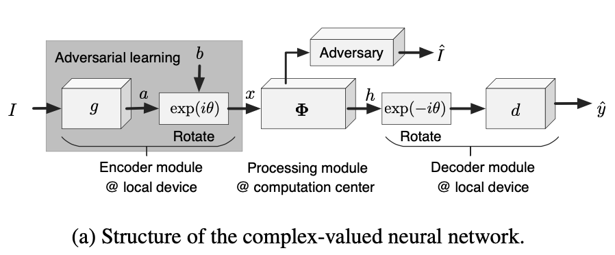

## Encryption of the image data under the deep learning framework

### 1. Introduction

The major tasks of the project are:

1. Ensure that the encrypted data cannot reflect the source data. (An adversary attacker who intercepts the features in the middle should not be able to recover the exact input.)
2. Ensure that the encryption has little effect on the performance of the recognition algorithm.

Approach: Reproduce the paper ***"INTERPRETABLE COMPLEX-VALUED NEURAL NETWORKS FOR PRIVACY PROTECTION"***

### 2. Background Knowledge

1. Complex Neural Network (from paper *"DEEP COMPLEX NETWORKS"*)

2. WGAN (from paper *"Wasserstein GAN"*)

### 3. Approach

Revise the original neural network into three parts -- Encoder module, Processing module, and Decoder module. Details are in the following.

Notation: $I$ as input.

#### 3.1 Network Architecture

- **Encoder module $(g)$**: Take source data as input. Encoder extracts feature from the input, then hide true feature by rotating the features by a randomized angle $\theta$ (trun to complex value here), then send the output to processing module.

  In training stage, this part contains a WGAN, where $g$ acts as generator. The WGAN trains generator $g$ with a discriminator $D$. The WGAN loss (Adversarial loss) is added to the total loss.

  *Formula:*

  $a = g(I)$		    		   $\longrightarrow$	Encoder module

  $x = exp(i\theta)[a+bi]$	 $\longrightarrow$	Bias term $b$ is of the same shape as $a$; $x$ is the rotated complex-valued data.

  

- **Processing module $(\Phi)$**: Use complex-valued neural networks here to implement the same part as original covolutional neural network (CNN). In this module, the rotated angle $\theta$ of source data is unknown. Then, send the output of this module to the decoder module.

  *Formula:*

  $h = \Phi(x)$		   		   $\longrightarrow$	Processing module

- **Decoder module $(d)$**: Rotate back the complex-valued data output of the processing module by angle $\theta$, to get the true feature. Then preform the rest structure of the original CNN.

  *Formula:*

  $\hat{y} = d(\mathcal{R}[h\cdot exp(-i\theta)])$	 $\longrightarrow$	Decoder module

  

  

- Note that in the graph (a), there is an adversary module having output $\hat{I}$. This module simulates the act of an attacker. Since the method of attack varies, including U-net, Gan, and other techniques, adversary module is not implemented in this project.

#### 3.2 Encryption Algorithm

The core design of the encryption part is to preserve the real features before encoder and after decoder. After rotating the complex- valued feature $a+bi$ by an angle $\theta$, all features of the following layers are rotated by the same angle. It could be verified that all layers of convolutional neural network are linear under rotation, i.e. it has the following property:

$\Phi(e^{i\theta}\cdot f) = e^{i\theta}\cdot\Phi(f),\ \ \ \forall\theta\in[0,2\pi]$

There are six most common types of network layers to construct the processing module, which all satisfy the above property:  **the convolution layer, the ReLU layer, the batch-normalization layer, the average/max pooling layer, the dropout layer, and the skip-connection operation.** Some of the above layers are revised a little from the original layer, in order to maintain the features after rotation. Details and proof are shown below:

*Proof of  $\Phi(e^{i\theta}\cdot x) = e^{i\theta}\cdot\Phi(x)$:*

- Convolution layer

  *Revise* the convolution layer by omitting the bias term.

  

  $\Phi(e^{i\theta}x) = w\otimes[e^{i\theta}x]=e^{i\theta}\Phi(x)$

  

- ReLU layer

  *Replace* the ReLU with the following non-linear layer:

  $\delta(f_{ijk})=\frac{||f_{ijk}||}{max\{||f_{ijk}||,\ c\}}\cdot x_{ijk}$	, where $c$ is a constant, and the value of $c$ may vary by different CNN architectures (Details are in the implementation section below); $f_{ijk}$ denotes the neural activation at the location $(i,j)$ in $k$-th channel of the feature.

  

  Element-wise operation proof:

  $\phi(e^{i\theta}x_{ijk}) = \frac{||e^{i\theta}x_{ijk}||}{max\{||e^{i\theta}x_{ijk}||,\ c\}}\cdot [e^{i\theta}x_{ijk}] = e^{i\theta}[\frac{||x_{ijk}||}{max\{||x_{ijk}||,\ c\}}\cdot x_{ijk}] = e^{i\theta}\phi(x_{ijk})$	, since $||e^{i\theta}||=1$

  

- Batch-normalization layer

  *Replace* the batch-normalization operation by:

  $norm(f^l_{ijk})=\frac{f^l_{ijk}}{\sqrt{E_{ijl}[||f^l_{ijk}||^2]}}$	, where $f^l$ denotes the $l$-th sample in the batch; $k$ denotes the $k$-th feature(channel) of the sample batch, i.e. the shape of each batch of samples is $[L,K,I,J]$.

  

  Element-wise operation proof:

  $\phi(e^{i\theta}x^l_{ijk})=\frac{e^{i\theta}x^l_{ijk}}{\sqrt{E_{ijl}[||e^{i\theta}x^l_{ijk}||^2]}}=e^{i\theta}[\frac{x^l_{ijk}}{\sqrt{E_{ijl}[||x^l_{ijk}||^2]}}]=e^{i\theta}\phi(x^l_{ijk})$

  

- Average/max pooling layer and droupout layer

  These layers could be represented by $\Phi(x)=Ax$, where $x$ is a vectorized feature, and $A$ denotes a matrix. Hence, we get

  $\Phi(e^{i\theta}x)=A(e^{i\theta}x)=e^{i\theta}[Ax]=e^{i\theta}\Phi(x)$

  

- Skip-connection operation

  $\Phi(e^{i\theta}x) = e^{i\theta}x+\Psi(e^{i\theta}x)=e^{i\theta}[x+\Psi(x)]=e^{i\theta}\Phi(x)$

  

#### 3.3 WGAN-based Encoder

**Objective:** Hide the real feature $a(=g(I))$ of the input $I$ in a certain phase $\theta$ of the encoded feature $x=exp(i\theta)[a+bi]$.

Let $a' = \mathcal{R}[x\cdot exp(-i\theta')]=\mathcal{R}[(a+bi)exp(i\theta-i\theta')]=\mathcal{R}[(a+bi)exp(i\Delta\theta)]$ denote a feature decoded using $\theta'$ ,where $\Delta\theta=\theta-\theta'\ne0$ . An ideal encoder $g$ requires:

1. decoded feature $a'$ contains sufficient information to cause obfuscation with the real feature $a$.
2. $a$ and $a'$ follow the same distribution , so as to hardly distinguish one from another.

Hence, we train encoder $g$ with a range of $\Delta\theta$ and $b$'s, and adopt GAN to distinguish different values of them. Let $D$ denote the discriminator, then train encoder $g$ over WGAN loss:

$min_gmax_D\ L(g,D)=\mathbb{E}_{I\sim p_\mathcal{I}}[D(a)-\mathbb{E}_{\Delta\theta\sim U(0,\pi),b\ne a}[D(a')]] = \mathbb{E}_{I\sim p_\mathcal{I}}[D(g(I))-\mathbb{E}_{\Delta\theta\sim U(0,\pi),b\ne g(I)}[D(\mathcal{R}[(g(I)+bi)e^{i\Delta\theta}])]]$

The expectation in this formula should be taken over all possible $\Delta\theta\ne 0$, where $\Delta\theta\in [0,\pi],\ \theta\in[0,2\pi]$.


**The overall loss** of learning is formulated as follows, which contains the adversarial loss and the loss for target task:

$min_{g,\Phi,d}\ max_D\ Loss\ =\ min_{g,\Phi,d}[max_DL(g,D)+L_{task}(\hat{y},y)]$


### 4 Experiments

#### 4.1 Implementation details

In the training, the model is separated in three parts: encoder ${g}$, processing $\Phi$, and decoder $d$. For simplicity, we combine it into 2 parts:

1. $g:a=g(I)$

2. $net: \hat{y} = net (a) = d(\mathcal{R}[\Phi(x)\cdot exp(-i\theta)])$, where $x = exp(i\theta)[a+bi]$.

We constructed complex-valued DNNs based on classical DNNs including ResNet-20, LeNet, AlexNet.

For ResNet, the output of the layer before the first $16 × 16$ feature map was fed to the aforementioned GAN, and layers following the first $8 × 8$ feature map constituted the decoder. The processing module of a residual network was modified such that $c = 1$ in $\delta(·)$ for all non-linear layers.

The encoder of the LeNet consisted of the first convolution layer and the GAN, whereas its decoder only contained the softmax layer.

For the AlexNet, the output of the first three convolution layers was fed into GAN, and the decoder contained fully-connected layers and the softmax layer. In the processing modules of these DNNs, we set $c_k = E_{ij}||x′_{ijk}||$ for neural activations in the $k$-th channel.

#### 4.2 Dataset

- Cifar-10 with LeNet and AlexNet as prototype models.
- Cifar-100 with ResNet-20 as prototype models.
- Celeb-A with AlexNet as prototype models. 

Cifar-10 and Cifar-100: https://www.cs.toronto.edu/~kriz/cifar.html

Celeb-A: http://mmlab.ie.cuhk.edu.hk/projects/CelebA.html

#### 4.3 Evaluatoin Metric

We evaluated the revised DNNs’ performance by accuracy and efficiency.

*Accuracy* concerned the performance of the model on the task. Specifically, in classification task, use the accuracy of getting the right group of each sample; in face recognition task, use EER as the evaluation metric.  Efficiency is measured in comparasion with the accuracy of original CNN and the processing time compared with the baseline. (Baseline: *Original DNNs* , *and DNNs trained without discriminators.*)

#### 4.4 Experimental results and analysis

In the following results, **Original net** refers to the unchanged net (original CNN); **Complex-valued net** refers to the revised complex-valued net (encoder module without GAN + processing module + decoder module), and **added GAN** refers to the GAN in encoder module.

In the revised DNN, **Complex-valued net** and **added GAN** are trained with different learning rate, where the learning rate of wGAN is 0.00005, as paper *"Wasserstein GAN"* lists.

The result shows that when training the revised DNN, the best approach is to set 4 optimizers, as following:

```
optimizer		: for processing module and decoder, update in target training
optimizer_g : for encoder, update in target training
optimizer_G : for encoder, update in wGAN training
optimizer_D : for discriminator, update in wGAN training
```

Also, the best method is to train wGAN is: train 1 time per batch on discriminator and 1 time per `critic` batches on decoder, where `critic` as paper  *"Wasserstein GAN"* indicates.

##### 4.4.1 LeNet on Cifar10

|               | (1)Original Lenet | (2.1)Complex-valued Lenet      | (2.2)added GAN                     | (3) Complex-valued Lenet without training GAN |
| ------------- | ----------------- | ------------------------------ | ---------------------------------- | --------------------------------------------- |
| Epoches       | 50                | 50                             |                                    | 50                                            |
| Batch size    | 64                | 64                             |                                    | 64                                            |
| Learning rate | 0.001             | 0.001                          | 0.00005                            | 0.001                                         |
| Loss Metric   | CrossEntropyLoss  | CrossEntropyLoss               | WGAN loss                          | CrossEntropyLoss                              |
| Optimizer     | Adam              | Adam `optimizer, optimizer_g ` | RMSprop `optimizer_G, optimizer_D` | Adam                                          |
| Test accuracy | 61 %              | 61%                            | loss value: $3.5983\times10^{-2}$  | 57%                                           |

The folowing are some **failure cases**:

- 50 epochs; for each batch in each epoch, train wGAN 5 times on discriminator and 1 time on decoder, 4 optimizers: Test accuracy 19%

- 50 epochs; train wGAN 1 time per batch on discriminator and 1 time per 5 batches on decoder, 3 optimizers (`optimizer_G = optimizer_g`): Test accuracy 21%, wGAN loss value: $0.57\times10^{-2}$
- 50 epochs; train wGAN 1 time per batch on discriminator and 1 time per 2 batches on decoder, 4 optimizers: Test accuracy 12%, wGAN loss value: $68.94\times10^{-2}$
- 80 epochs; train wGAN 1 time per batch on discriminator and 1 time per 2 batches on decoder, 4 optimizers: Test accuracy 41%

- Also, for Lenet on Cifar10, when setting epochs larger than 50, the model would be overfitting.

**Analysis: **

The results and failure cases show that

1. If train wGAN 5 times on discriminator and 1 time on decoder for each batch, meaning training wGAN too much, will lower the expected test accuracy.
2. If use one optimizer on decoder for both target training and wGAN training (learning rate of wGAN and Lenet for decoder is thus the same), the test accuracy will decrease, although wGAN loss value is small.
3. The Lenet CNN without GAN may loss a little accuracy, but the training of wGAN can lead to a similar performance compared to the original Lenet.


##### 4.4.2 AlexNet on cifar10

|               | (1)Original Alexnet                      | (2.1)Complex-valued Alexnet              | (2.2)added GAN                     | (3) Complex-valued Alexnet without training GAN |
| ------------- | ---------------------------------------- | ---------------------------------------- | ---------------------------------- | ----------------------------------------------- |
| Epoches       | 150                                      | 150                                      |                                    | 150                                             |
| Batch size    | 128                                      | 128                                      |                                    | 128                                             |
| Learning rate | 0.001, decay by 10 on epochs `[60, 120]` | 0.001, decay by 10 on epochs `[60, 120]` | 0.00005                            | 0.001, decay by 10 on epochs `[60, 120]`        |
| Loss Metric   | CrossEntropyLoss                         | CrossEntropyLoss                         | WGAN loss                          | CrossEntropyLoss                                |
| Optimizer     | Adam                                     | RMSprop `optimizer, optimizer_g`         | RMSprop `optimizer_G, optimizer_D` | RMSprop                                         |
| Test accuracy | 81.750%                                  | 80.130%                                  | loss value: $4.7110\times10^{-2}$  | 85.930%                                         |

**Failure case:**

- In one epoch, train wGAN 5 times on discriminator and 1 time on decoder: In training, the gradient will disappear, and loss will become 'nan' after 30 epochs

**Analysis:**

1. If we train wGAN more frequently than the CNN, we will lose gradient after several epochs. The optimizer update order should be carefully considered.
2. Original Alexnet has test acc 81.750%, revised Alexnet has test acc 80.130%, indicating that the revision of net structure does not influence the prediction accuracy.

##### 4.4.3 ResNet20 on cifar 100

|               | (1)Original ResNet20                     | (2.1)Complex-valued ResNet20             | (2.2)added GAN                     | (3) Complex-valued ResNet20 without training GAN |
| ------------- | ---------------------------------------- | ---------------------------------------- | ---------------------------------- | ------------------------------------------------ |
| Epoches       | 150                                      | 150                                      |                                    | 150                                              |
| Batch size    | 128                                      | 128                                      |                                    | 128                                              |
| Learning rate | 0.001, decay by 10 on epochs `[80, 120]` | 0.001, decay by 10 on epochs `[80, 120]` | 0.00005                            | 0.001, decay by 10 on epochs `[60, 120]`         |
| Loss Metric   | CrossEntropyLoss                         | CrossEntropyLoss                         | WGAN loss                          | CrossEntropyLoss                                 |
| Optimizer     | SGD                                      | SGD     `optimizer, optimizer_g`         | RMSprop `optimizer_G, optimizer_D` | SGD                                              |
| Test accuracy | 67.810%                                  | 57.27%                                   | loss value: $0.7481\times10^{-2}$  | 44.35%                                           |

To get above results, the design of batch-norm layer is: compute std over channels and set weight to be the only parameter.

**Unsatisfing cases:** 

(1) In batch-norm layer design, compute std over samples. (This method is false.)

- Without training of D (affine false) : 33.650%
- 150 epochs;  in one epoch, 1 on D and 1/5 on g,  CRITIC =5, 4 optimizers(`affine = False`): accuracy 54.540%; loss value: $1.6555\times10^{-2}$
- Without training of D (affine True on `shape[1]`): 40.640%
- 150  in one epoch, 1 on D and 1/5 on g,  CRITIC =5, 4 optimizers(`affine = True` on `shape[1]`): 3.870%; wGAN loss value: $0.0256\times10^{-2}$

(2) In batch-norm layer design, compute std over channels. (consistent with the paper) However, the parameters are weight and bias.

- Without training of D (affine True): CrossEntropyLoss value: 0.5371; Train accuracy: 84.375%; Test accuracy: 1.380% .
- 150  in one epoch, 1 on D and 1/5 on g,  CRITIC =5, 4 optimizers: wGAN loss value: $0.8009\times10^{-2}$; CrossEntropyLoss value: 0.5706; test accuracy: 9.650%; 

**Analysis:**

1. Since the ResNet includes batchnorm layers, in the design of complex-valued batch-norm layer, the normalization operation is replaced by $norm(f^l_{ijk})=\frac{f^l_{ijk}}{\sqrt{E_{ijl}[||f^l_{ijk}||^2]}}$. Hence, the variance should be calculated over number of channels ($K$), not number of samples ($L$). The first four unsatisfing cases is under the wrong batch-norm calculation. With the right version of complex-valued batch-norm layer, the revised DNN has a similar performance as the orginal ResNet.

2. In the design of complex-valued batch-norm layer, since our operation formula omits the bias term, then we also need to omit the bias parameter. Hence, the parameter for learning should only be the weight. Otherwise, the test accuracy fluctuates during training and it is easy to overfit.

3. Include wGAN in training would improve the test accuracy than just use complex-valued network. However, there would still be accuracy loss comparaing to the original ResNet20. This is probably caused by the revised batch-norm layer.

   

##### 4.4.3 AlexNet on cifar 100

|               | (1)Original Alexnet                 | (2.1)Complex-valued Alexnet         | (2.2)added GAN                     | (3) Complex-valued Alexnet without training GAN |
| ------------- | ----------------------------------- | ----------------------------------- | ---------------------------------- | ----------------------------------------------- |
| Epoches       | 100                                 | 100                                 |                                    | 100                                             |
| Batch size    | 128                                 | 128                                 |                                    | 128                                             |
| Learning rate | 0.0001, decay by 10 on epoch `[60]` | 0.0001, decay by 10 on epoch `[60]` | 0.00005                            | 0.0001, decay by 10 on epoch `[60]`             |
| Loss Metric   | CrossEntropyLoss                    | CrossEntropyLoss                    | WGAN loss                          | CrossEntropyLoss                                |
| Optimizer     | Adam                                | RMSprop `optimizer, optimizer_g`    | RMSprop `optimizer_G, optimizer_D` | RMSprop                                         |
| eer           | 0.0807                              | 0.0988                              | loss value: $4.65\times10^{-2}$    | 0.0885                                          |

**Unsatisfing cases:** 

In one epoch, 1 on D and 1/$CRITIC$ on g. When $CRITIC <40$, the gradient would become nan quickly in the first several epochs.

**Analysis:**

To ensure the existence of gradient, the value of $CRITIC$ is set to be $40$.

The 'Test accuracy' metric is the same as above classification accuracy. In CelebA, there are $10,177$ identities, which could be treated as an classification problem of $10,177$ classes.

